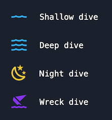
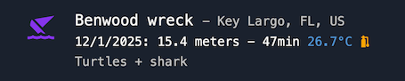

# scuba-diving-log-book


This project generates a cool looking scuba-diving log book (with summary data and grouped by year) based on a log file in JSON format.

Checkout the live demo with my [scuba-diving log book](https://evoluteur.github.io/scuba-diving-log-book/).




Data structure:

```typescript
Dive {
    date: string, // mm/dd/yyyy
    depth: number, // in meters
    duration: number, // in minutes
    site: string,
    city?: string,
    state?: string,
    country?: string,
    night?: boolean,
    wreck?: boolean,
    nitrox?: number, // % oxygen
    temperature?: number, // in celsius
    notes?: string,
}
```

Example dive data:

```typescript
  {
    date: "12/1/2025",
    depth: 15.4,
    duration: 47,
    site: "Benwood wreck",
    city: "Key Largo",
    state: "FL",
    country: "US",
    nitrox: 31,
    wreck: true,
    temperature: 26.7,
    notes: "Turtles + shark",
  }
```

Example dive display:


The code available on [GitHub](https://github.com/evoluteur/scuba-diving-log-book) under the [MIT license](https://github.com/evoluteur/scuba-diving-log-book/blob/main/LICENSE).

Copyright (c) 2026 [Olivier Giulieri](https://evoluteur.github.io/).
